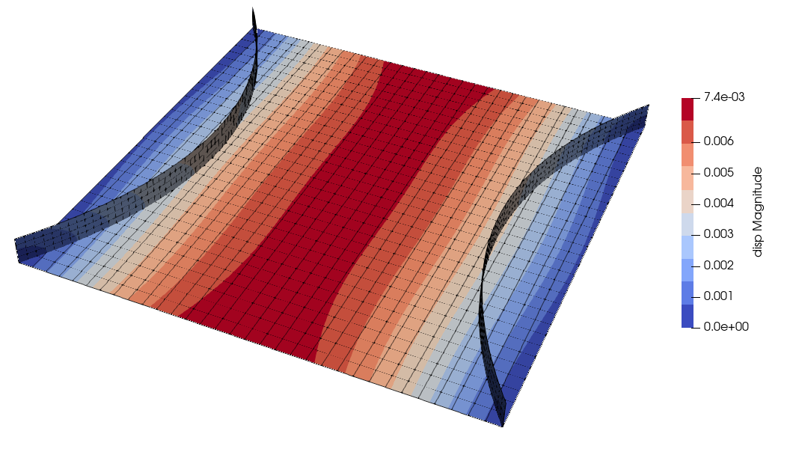
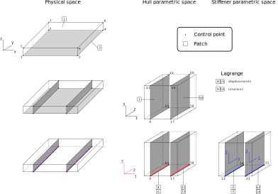
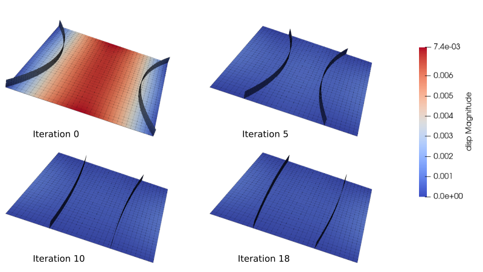

Optimization of a stiffened roof
================================

This exemple is located in directory :file:`examples/OPT_stiffPanel`.

Problem description
-------------------

The problem of the stiffened roof is derived from the initial shape optimization problem of a roof under vertical uniform load :cite:`bletzinger_computational_2005,kegl_shape_2006`.
Two stiffeners are added to the initial square plate. We introduce two embedded surfaces to define these stiffeners as shown in :numref:`fig-initial-geometry-stiffened-roof`.

.. _fig-initial-geometry-stiffened-roof:

   Initial geometry of stiffened roof.

The square plate can be defined from 4 control points:

..  code-block::

    1, -5.00, -5.00,  0.00
    2,  5.00, -5.00,  0.00
    3, -5.00,  5.00,  0.00
    4,  5.00,  5.00,  0.00

And the connectivity table, defining patch 2, of type U3 (shell) made of a single element:

..  code-block::
    *Element,type=U3,elset=RoofEls
    2,    4,3,2,1

Based on the square plate, a hull is defined, made of 8 control points, four of which are those of the plate:

..  code-block::

    1, -5.00, -5.00,  0.00
    2,  5.00, -5.00,  0.00
    3, -5.00,  5.00,  0.00
    4,  5.00,  5.00,  0.00
    5, -5.00, -5.00,  0.60
    6,  5.00, -5.00,  0.60
    7, -5.00,  5.00,  0.60
    8,  5.00,  5.00,  0.60

Connectivity table, defining patch 1, of type U0 (hull) made of a single element:

..  code-block::

    *Element,type=U0,elset=MappingEls
    1,    8,7,6,5,4,3,2,1

The stiffeners are defined in the parametric space of the hull, and are defined as linear plates for the sake of simplicity:

..  code-block::

    9,  0.30,  0.00,  0.00
    10,  0.30,  1.00,  0.00
    11,  0.30,  0.00,  1.00
    12,  0.30,  1.00,  1.00

    17,  0.70,  0.00,  0.00
    18,  0.70,  1.00,  0.00
    19,  0.70,  0.00,  1.00
    20,  0.70,  1.00,  1.00

Connectivity table, defining the stiffeners as patches 3 and 10, of tye U30 (embedded shells):

..  code-block::

    *Element,type=U30,elset=SurfaceEls
    3,    12,11,10,9
    10,   20,19,18,17

Then, curve elements are defined to represent the interface between the stiffeners and the square plate.
Let us consider the interface between stiffener patch 3 and square plate patch 2. Patch 4 is the interface seen from patch 2 (defined in physical space) and patch 5 is the interface seen from patch 3 (defined in hull parametric space).
Control points are:

..  code-block::

    9,  0.30,  0.00,  0.00
    10,  0.30,  1.00,  0.00

    13,  0.00,  0.00,  0.00
    14,  1.00,  0.00,  0.00

Connectivity table:

..  code-block::

    *Element,type=U00,elset=CurveEls
    4,    10,9
    5,    14,13

This interface will take into account displacements coupling and a duplicate (patches 6 and 7) is made to handle rotations coupling.

The same is made for the second stiffener (patches 11 and 12 for displacements, 13 and 14 for rotations).

Then, Lagrange patchs are defined to handle Lagrange multipliers for the coupling:

 - patch 8 for coupling between patch 2 and 3 (displacements)
 - patch 9 for coupling between patch 2 and 3 (rotations)
 - patch 15 for coupling between patch 2 and 10 (displacements)
 - patch 16 for coupling between patch 2 and 10 (rotations)

Those patchs are made of a single control point, located at arbitrary location.

A summary of control points and patches indices is made in :numref:`fig-ctrls-patchs-stiffened-roof`.

.. _fig-ctrls-patchs-stiffened-roof:

   Control points and patch of the stiffened roof.

Optimization of stiffeners position
-----------------------------------

This case is defined in the Python script :file:`examples/OPT_stiffPanel/optim_stiff_position.py`.

The aim of the optimization process is to minimize the compliance of teh structure while keeping the volume below a 10% variation.

Optimization model
~~~~~~~~~~~~~~~~~~

To allow shape modifications, the initial model is refined to obtain the optimization model. Plate and hull are elevated to degree 3 and 2 subdivisions are performed in 1st and 2nd parametrc directions:

..  code-block:: python

    nb_deg[:2, 0:2] = 2
    nb_ref[:2, 0:2] = 2

Stiffeners and linked curves are elevated to degree 2 in the the first parametric direction:

..  code-block:: python

    nb_deg[0, np.array([3, 4, 6, 10, 11, 13])-1] = 1

The design variables are chosen to move the control points of the stiffeners. A shape modification function can be defined:

..  code-block:: python

    def movestiffener(coords0, igapara, var):
        """
        Shape modification function : move stiffeners control points
        """

        igapara._COORDS[:, :] = coords0[:, :]

        # Move 1st stiffener
        igapara._COORDS[0, igapara._indCPbyPatch[2][cpS[:]]-1] =\
            0.50*var[:int(nb_varS/2)]
        igapara._COORDS[0, igapara._indCPbyPatch[2][cpS[:]+cpS.size]-1] =\
            0.50*var[:int(nb_varS/2)]

        # Move 2nd stiffener
        igapara._COORDS[0, igapara._indCPbyPatch[9][cpS[:]]-1] =\
            1. - 0.50*var[int(nb_varS/2):]
        igapara._COORDS[0, igapara._indCPbyPatch[9][cpS[:]+cpS.size]-1] =\
            1. - 0.50*var[int(nb_varS/2):]

        return None

There are 6 designe variables, allowing to move the control points of the stiffeners.
To obtain the initial stiffeners position shown in :numref:`fig-initial-geometry-stiffened-roof`, an initialization is made with:

..  code-block:: python

    movestiffener(modeleIGA._COORDS.copy(), modeleIGA,
                  np.array([0., 0.7, 0., 0., 0.7, 0.]))

Anaysis model
~~~~~~~~~~~~~

The analysis model is defined by refining the optimization model:

..  code-block:: python

    # plate
    nb_deg[:2, :2] = 0
    nb_ref[:2, :2] = 3

    # stiffeners and linked curves
    nb_deg[0, np.array([3, 4, 6, 10, 11, 13])-1] = 1
    nb_ref[0, np.array([3, 4, 6, 10, 11, 13])-1] = 6

    nb_deg[1, np.array([3, 10])-1] = 2
    nb_ref[1, np.array([3, 10])-1] = 2

    nb_ref[0, np.array([5, 7, 12, 14])-1] = 6

    # Lagrange multipliers
    nb_deg[0, np.array([8, 15])-1] = 2
    nb_deg[0, np.array([9, 16])-1] = 1
    nb_ref[0, np.array([8, 9, 15, 16])-1] = 5

An :class:`OPTmodelling` object is built to define the optimization problem. It takes as arguments the optimization model, the number of design variables, the shape modification function and the refinements from optimization to analysis model:

..  code-block:: python

    optPB = OPTmodelling(modeleIGA, nb_varS, movestiffener,
                         nb_degreeElevationByDirection=nb_deg,
                         nb_refinementByDirection=nb_ref)

Sensibilities computation
~~~~~~~~~~~~~~~~~~~~~~~~~

A function is defined to compute relative compliance and its gradient with respect to design variables ``xC``:

..  code-block:: python

    def comp(xC, gradC):
        """
        Compliance and gradient of compliance computation
        (relative to initial value)
        """
        ci = optPB.compute_compliance_discrete(xC)/c0
        if gradC.size > 0:
            global i
            i += 1
            gradC[:] = optPB.compute_gradCompliance_cplgOnly_AN(xC)/c0
            gradC[:] += optPB.compute_gradCompliance_AN(xC)/c0

        return ci

Another function compute ralative volume variation and its gradient:

..  code-block:: python

    def vol(xV, gradV):
        """
        Volume and gradient of volume computation
        (relative to initial value)
        """
        global listpatch
        if gradV.size > 0:
            gradV[:] = optPB.compute_gradVolume_AN(xV, listpatch)/V0
    return optPB.compute_volume(xV, listpatch)/V0 - 1.

Finally, an :class:`nlopt.opt` object is built to solve the optimization problem, defining the objective function, constrainst functions, the bounds of design variables and various options:

Optimization problem solving
~~~~~~~~~~~~~~~~~~~~~~~~~~~~

..  code-block:: python

    minimize = nlopt.opt(nlopt.LD_SLSQP, nb_varS)

    minimize.set_min_objective(comp)
    minimize.add_inequality_constraint(vol, 1e-5)

    minimize.set_ftol_rel(1.0e-06)
    minimize.set_xtol_rel(1.0e-06)
    minimize.set_maxeval(400)

    minimize.set_lower_bounds(0.*np.ones(nb_varS))
    minimize.set_upper_bounds(1.*np.ones(nb_varS))

    x = minimize.optimize(x0)

Optimization results are shown in :numref:`fig-stiffened-roof-results`.

.. _fig-stiffened-roof-results:

   Optimization results for stiffeners position.