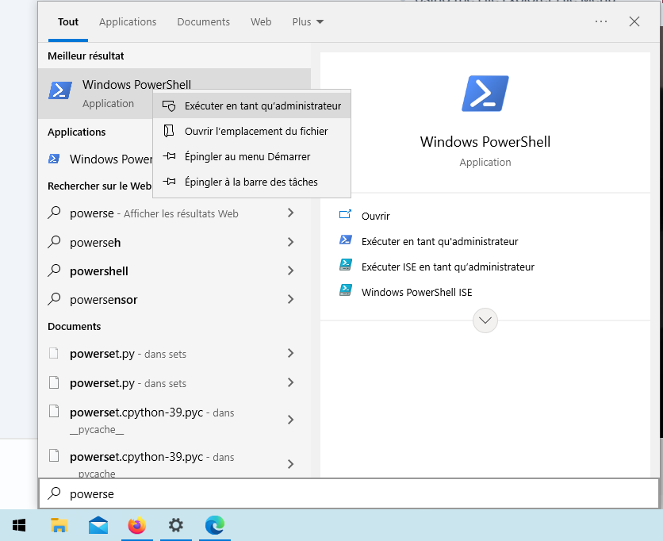
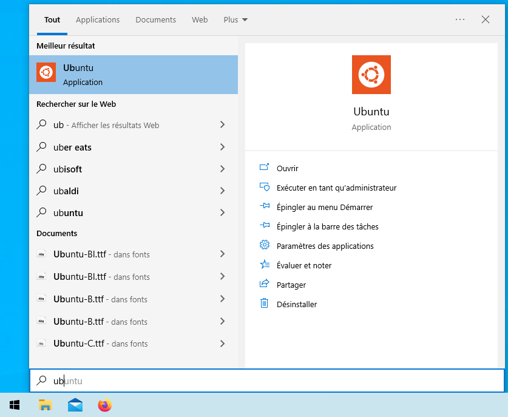

..  _install-wsl:

Windows Subsystem for Linux installation
****************************************

This procedure has been tested on Windows 10, build 19044.2006

Start by opening a Windows Powershell with adminitrstor rights : 

In this powershell, run the following command to install Windows Subsystem for Linux with the Ubuntu distribution : 

``wsl --install -d Ubuntu``

Force the use of WSL version 1 : 

``wsl --set-default-version 1``

Restart Windows.

For the start menu, launch Ubuntu application : 

You will be asked to set a news user name and a password.

Your Windows Subsystem is now ready. You can continue by installing YETI.