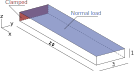
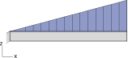
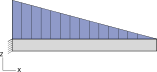

================
Validation tests
================

.. contents:: Table of Contents
   :depth: 1
   :local:
   :backlinks: none

Distributed load
================

These tests are implemented in :file:`benchs/dload` directory.
They consist in loading a clamped volumic beam with a distributed load (uniform or triangular). Results are then compared with analytical solutions from beam theory.
4 cases are available: 

 - basic uniform load: :file:`dload_beam_dist.py`
 - uniform load using the syntax of nodal distribution: :file:`dload_beam_dist_field.py`
 - triangular load with zero value on clamped side: :file:`dload_beam_triangular_1.py`
 - triangular load with zero value on free side: :file:`dload_beam_triangular_2.py`

Geometry
--------

As shown in figure Figure :numref:`fig-geometry-dload`, the initial geometry defined in :file:`.inp` files is a parallelepiped with x, y, z dimensions 20 x 1 x 3 mm. It is clamped on face x=0 and the load is applied on face z=3 mm.
It is then refined to degree 2 with 32, 4 and 4 elements in x, y and z directions.

.. _fig-geometry-dload:

   Geometry for validation of distributed load.

Uniform load
------------

This case in defined in file :file:`dload_beam_dist.py`. In input file :file:`beam-dist.inp`, distributed load is defined *via* the command :

..  code-block:: 

    *Dload
    I1.EltPAtch1, U40, 1000.

It defines a uniform normal load with value of 1000 per unit of surface on face 4.

The analytical solution for this problem with beam theory gives the following formula for the maximal deflexion :

..  math::

    f = - \frac{q_0 b L^4}{8 E I} \quad \text{with} \quad I = \frac{b h^3}{12}

Here : 
 - b = 3
 - h = 1
 - E = 210000
 - L = 20
 - q0 = 1000

To validate the test, the displacement in z direction for the interpolating control point located at coordinates (20, 0, 0) must be equal to the analytical solution with a tolerance of 2%.

Uniform load set with a nodal distribution
------------------------------------------

This case is the same as the previous test. The only difference is that the load is defined through a nodal distribution.
In the input file :file:`beam-dist-field.inp`, the nodal distribution is defined as :

..  code-block::

    *DISTRIBUTION, NAME=presField, LOCATION=NODE
    3, 1000.0
    4, 1000.0
    7, 1000.0
    8, 1000.0

Indices 3, 4, 7, 8 correspond to the control points defining the surface located et z = 3 on the geometry before refinement.
The nodal distribution sets a value of 1000 for all these points, wich will result as a uniform distribution.

Loading is then defined as :

..  code-block::

    *Dload
    I1.EltPAtch1, U44, presField

It defines a load from a nodal distribution name *presField* on the face number 4 of the elements contained in the set *I1.EltPAtch1*.

To validate the test, the displacement in z direction for the interpolating control point located at coordinates (20, 0, 0) must be equal to the analytical solution with a tolerance of 2%.

Triangular load with zero value on clamped side
-----------------------------------------------

This case is defined in file :file:`dload_beam_triangular_1.py`. The distributed load varies linaerly through the length of the beam as shown if figure :numref:`fig-dload-triangular-increase`. The nodal distribution is set in file :file:`beam-triangle-1.inp` :

..  code-block::
    
   *DISTRIBUTION, NAME=presField, LOCATION=NODE
    3, 0.0
    4, 0.0
    7, 1000.
    8, 1000.

.. _fig-dload-triangular-increase:

   Triangular increasing distributed load.

And the load is set with :

..  code-block::

    *Dload
    I1.EltPAtch1, U44, presField

An analytical solution with beam theory exists for the maximal deflexion. It reads :

..  math::

    f = - \frac{11 q_0 b L^4}{120 E I} \quad \text{with} \quad I = \frac{b h^3}{12}

To validate the test, the displacement in z direction for the interpolating control point located at coordinates (20, 0, 0) must be equal to the analytical solution with a tolerance of 2%.

Triangular load with zero value on free side
-----------------------------------------------

This case is defined in file :file:`dload_beam_triangular_2.py`. The distributed load varies linaerly through the length of the beam as shown if figure :numref:`fig-dload-triangular-decrease`. The nodal distribution is set in file :file:`beam-triangle-2.inp` :

..  code-block::
    
   *DISTRIBUTION, NAME=presField, LOCATION=NODE
    3, 1000.
    4, 1000.
    7, 0.0
    8, 0.0

.. _fig-dload-triangular-decrease:

   Triangular decreasing distributed load.

   And the load is set with :

..  code-block::

    *Dload
    I1.EltPAtch1, U44, presField

An analytical solution with beam theory exists for the maximal deflexion. It reads :

..  math::

    f = - \frac{q_0 b L^4}{30 E I} \quad \text{with} \quad I = \frac{b h^3}{12}

To validate the test, the displacement in z direction for the interpolating control point located at coordinates (20, 0, 0) must be equal to the analytical solution with a tolerance of 2%.
